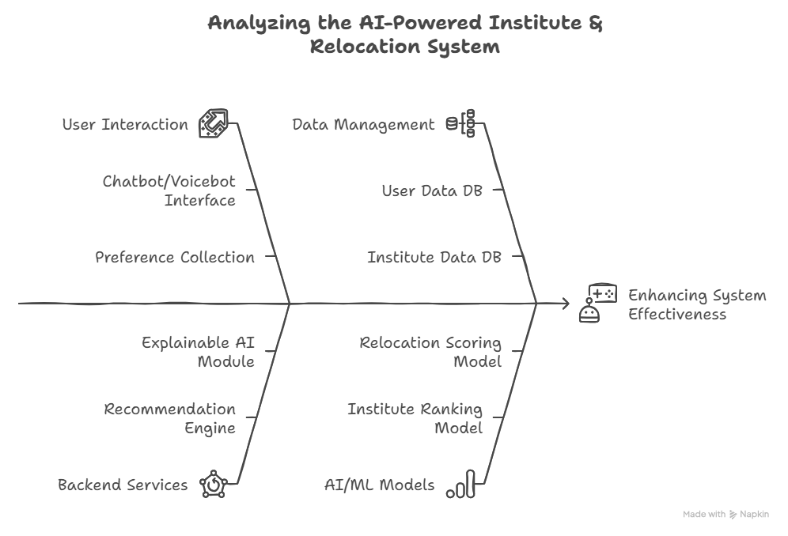
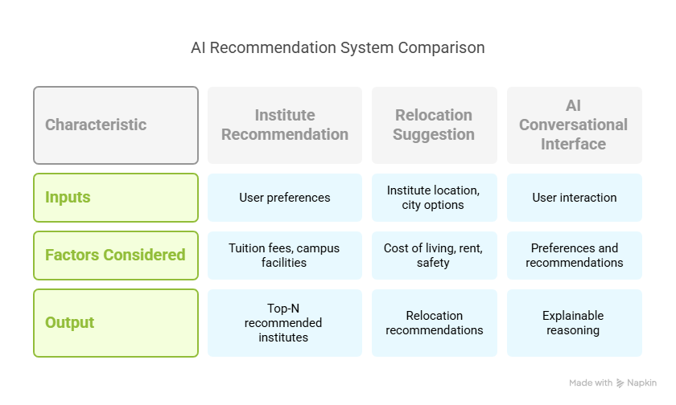

# 🎓 EduPath: Smart Choices. Brighter Futures.

**EduPath** is an AI-powered recommendation system designed to help students make well-informed decisions about their academic future. With intelligent institute suggestions and smart relocation guidance, EduPath brings transparency, personalization, and clarity to one of life’s biggest decisions.

---

## 📌 Features

### 1. 🏫 Institute Recommendation
Recommends top educational institutes based on:
- Tuition fee
- Campus facilities
- Department ranking
- Distance from home
- Transportation availability
- Job placement rate

**User Inputs:** Budget, preferred city, field of interest, etc.  
**Output:** Top-N recommended institutes with **explainable AI justifications**

---

### 2. 🚚 Relocation Suggestion
Suggests ideal cities to relocate by analyzing:
- Cost of living
- Rent prices
- Safety index
- Institute location
- Nearby job markets

**Output:** Best relocation options based on personal and financial preferences.

---

## 🤖 AI Conversational Interface
EduPath features a chatbot/voicebot that:
- Collects user preferences through conversation
- Provides real-time recommendations
- Offers explainable and context-aware insights

---

## 🧠 How It Works

### 🔄 App Flow

---

### 📥 Inputs vs 📤 Outputs

---

## 🏗️ Tech Stack

- **Frontend:** React / Flutter  
- **Backend:** Node.js / Django  
- **Database:** PostgreSQL / MongoDB  
- **AI/ML:** Scikit-learn, XGBoost, SHAP (for explainability)  
- **Chatbot:** Rasa / Dialogflow  
- **Cloud:** AWS / Azure / GCP

---

## 🚀 Getting Started

> _Coming soon_

---

## 📄 License

MIT License. Feel free to use, modify, and contribute!

---

## 💬 Let's Connect

Have feedback or want to collaborate? Open an issue or reach out!
